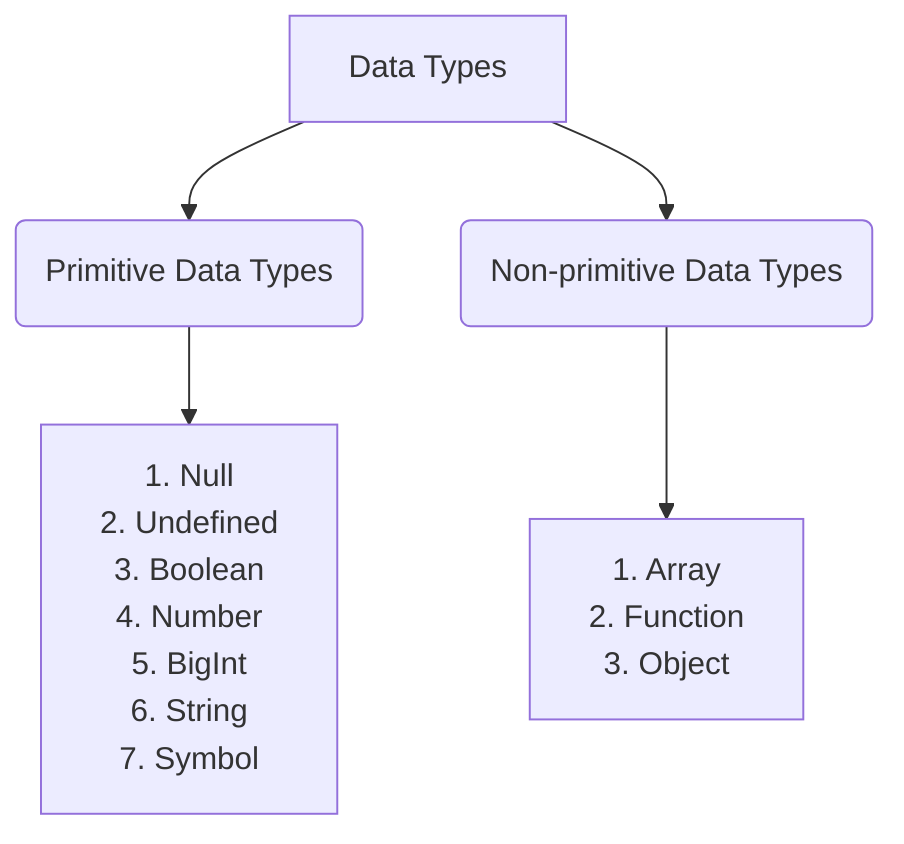

# Data Types

## Table of Content

- [Data Types](#data-types)
  - [Primitive Data Types](#primitive-data-types)
    - [Null](#1-null)
    - [Undefined]()
    - [Boolean](#3-boolean)
    - [Number](#4-number)
    - [BigInt](#5-bigint)
    - [String](#6-string)
    - [Symbol](#7-symbol)
  - [Non-primitive Data Types](#non-primitive-data-types)
    - [Arrays](#arrays)
    - [Object](#object)
  - [Checking Data Types and Casting](#checking-data-types-and-casting)
    - [Checking Data Types](#checking-data-types)
    - [Changing Data Type (Casting)](#changing-data-type-casting)
      - [String to Int](#string-to-int)
      - [String to Float](#string-to-float)
      - [Float to Int](#float-to-int)

## Data Types



There are eight data types in JavaScript. Seven of them are called "primitive" because their values contain only one thing (a string or a number or whatever). The other is called "non-primitive".

Primitive data types hold a single value. They can be compared by value and cannot be edited. Non-primitive data types can hold more than one value. They can be modified and edited, but cannot be compared by value.

### Primitive Data Types

#### 1. Null:

The null type contains only the value "null". It does not take any other value.

**Example:**

```js
let age = null;
// age is a null type
```

#### 2. Undefined:

Undefined type has only the value "undefined". It does not take any other value. The meaning of `undefined` is “value is not assigned”. I mean if a variable is declared, but not assigned any value to variable is undefined.

**Examples:**

```js
let x;
// x is a undefind type
```

#### 3. Boolean:

The boolean type has only two values: `true` and `false`. This type is commonly used to store yes/no values: `true` means “yes, correct”, and `false` means “no, incorrect”.

**Examples:**

```js
let x = 3;
let y = 3;
let z = 7;
(x == y)(
  // Returns true
  x == z
)(
  // Returns false
  y == z
); // Returns false
```

#### 4. Number:

The _number_ type represents both integer and floating point numbers. Besides regular numbers, there are so-called “special numeric values” which also belong to this data type: `Infinity`, `-Infinity` and `NaN`.

- `Infinity` represents the mathematical [Infinity](https://en.wikipedia.org/wiki/Infinity) ∞. It is a special value that’s greater than any number. We can get it as a result of division by zero.

- `-Infinity` is a special value that is smaller than any number. We can get it as a result of divide any negative number by zero or multiply Infinity by any negative number.

- `NaN` represents a computational error. It is a result of an incorrect or an undefined mathematical operation, for instance. Any further mathematical operation on `NaN` returns `NaN`. If there’s a `NaN` somewhere in a mathematical expression, it propagates to the whole result (there’s only one exception to that: `NaN ** 0` is `1`).

**Examples:**

```js
let x = 1;
let y = 0;
// x is a number type

let z = x / y;
// z is a Infinity number type

let w = -1 * z;
let t = -5 / 0;
// w and t are -Infinity number type

let m = "apple" / 2;
let n = "banana" / "melon";
let k = NaN / 3;
// m, n and k are NaN type
```

#### 5. BigInt:

All JavaScript numbers are stored in a a 64-bit floating-point format. In JavaScript, the “number” type cannot safely represent integer values larger than (2^53^-1) (that’s `9007199254740991`), or less than -(2^53^-1) for negatives. To be really precise, the “number” type can store larger integers (up to `1.7976931348623157 * 10308`), but outside of the safe integer range ±(2^53^-1) there’ll be a precision error, because not all digits fit into the fixed 64-bit storage. So an “approximate” value may be stored.

**Example:**

```js
let x = 9007199254740991; // x is (2^53-1)
(x + 1)(
  // Returns 9007199254740992
  x + 2
)(
  // Returns 9007199254740992
  x + 10
); // Returns 9007199254740992
```

So to say, all odd integers greater than (2^53^-1) can’t be stored at all in the “number” type.
A `BigInt` value is created by appending `n` to the end of an integer.

```js
	const x = 26785128642153e982153798271639n;
	let y = BigInt (17613794237964893264120728);
	// x and y are BigInt type
```

#### 6. String:

Strings are written with quotes. You can use single or double quotes.

In JavaScript, there are 3 types of quotes.

```markdown
    1. Double quotes: "String"
    2. Single quotes: 'String'
    3. Backticks: `String`
    4. \n: new line
    5. \t: Tab, means 8 spaces
```

**Examples:**

```js
let pcName = "Apple";
console.log(pcName); // pcName is a string type
------------------------------------------------------------------------------------------------
let name = "Mahmut";
let surname = "BEYAZGÜL";
let fullName1 = name + "  " + surname;
console.log(fullName1); // Mahmut BEYAZGÜL
------------------------------------------------------------------------------------------------
// or we can use template strings
let fullName2 = `${name}  ${surname}`; // Mahmut BEYAZGÜL
console.log(fullName2);
------------------------------------------------------------------------------------------------
// use length
let carName1 = "Ford";
console.log(carName1.length); // 4
------------------------------------------------------------------------------------------------
// use toUpperCase
console.log(carName1.toUpperCase()); // FORD
------------------------------------------------------------------------------------------------
// use toLowerCase
console.log(carName1.toLowerCase()); // ford
------------------------------------------------------------------------------------------------
// use substr()
let carName2 = "Volkswagen";
console.log(carName2.substr(4)); // swagen
console.log(carName2.substr(4, 3)); // swa
------------------------------------------------------------------------------------------------
// use substring()
console.log(carName2.substring(4)); // swagen
console.log(carName2.substring(4, 6)); // sw
------------------------------------------------------------------------------------------------
// use split()
let sentence1 = "I love JavaScript";
console.log(sentence1.split("  ")); // (3) ['I', 'love', 'JavaScript']
console.log(carName1.split("")); // ['F', 'o', 'r', 'd']
------------------------------------------------------------------------------------------------
// use trim() -->> still removes spaces at the beginning and the end of the string
let carName3 = "Porsche ";
console.log(carName3.trim()); // Porsche
// or
console.log(carName3.trim("  ")); // Porsche
------------------------------------------------------------------------------------------------
// use includes() -->> It takes a substring argument and it checks if substring argument exists in the string. Returns a boolean.
console.log(sentence1.includes("love")); // true
console.log(sentence1.includes("Love")); // false
console.log(sentence1.includes("much")); // false
------------------------------------------------------------------------------------------------
// use replace() -->> Takes as a parameter the old substring and a new substring
console.log(sentence1.replace("JavaScript", "PHP")); // I love PHP
console.log(carName2.replace("Volks", "Ford")); // carName2 => Fordwagen
------------------------------------------------------------------------------------------------
// use charAt() -->> Takes index and it returns the valuse at that index
console.log(carName2.charAt(1)); // It returns 'o'
let lastIndex = carName2.length - 1;
console.log(carName2.charAt(lastIndex)); // It returns 'n'
------------------------------------------------------------------------------------------------
// use indexOf() -->> Takes a substring and if the substring exists in a string it returns the first position of the substring if does not exist it returns -1
console.log(sentence1.indexOf("l")); // It returns 2
console.log(sentence1.indexOf("love")); // It returns 2
console.log(sentence1.indexOf("like")); // It returns -1
console.log(sentence1.indexOf("a")); // It returns 8
------------------------------------------------------------------------------------------------
// use lastIndexOf() -->> Takes a substring and if the substring exists in a string it returns the last position of the substring if does not exist it returns -1
let sentence2 = "I love JavaScript. Do you love too?";
console.log(sentence2.lastIndexOf("love")); // It returns 26
------------------------------------------------------------------------------------------------
// use concat() -->> It takes many substrings and joins them.
console.log(sentence1.concat("  ", "and", "  ", "PHP.")); // It returns I love JavaScript and PHP.
------------------------------------------------------------------------------------------------
// use startsWith() -->> It takes a substring as an argument and it checks if the string starts with that specified substring. It returns a boolean.
console.log(sentence2.startsWith("I")); // true
console.log(sentence2.startsWith("i")); // false
console.log(sentence2.startsWith("JavaScript")); // false
------------------------------------------------------------------------------------------------
// use endsWith() -->> It takes a substring as an argument and it checks if the string ends with that specified substring. It returns a boolean.
console.log(sentence2.endsWith("too?")); // true
console.log(sentence2.endsWith("you love too")); // false
console.log(sentence2.endsWith("you love too?")); // true
------------------------------------------------------------------------------------------------
// use search() -->> It takes a substring as an argument an it returns the index of the first match. The search value can be a string or regular expression pattern.
console.log(sentence2.search("JavaScript")); // It returns 7
------------------------------------------------------------------------------------------------
// use match() -->> It takes a substring or regular expression pattern as an argument and it returns an array if there is match if not it returns null. Let us see how a regular expression pattern looks like. It starts with / sign and ends with / sign.
let sentence3 = "I love JavaScript and i love PHP very much. Do you Love too?";
console.log(sentence3.match("love")); // ["love", groups: undefined, index: 2, input: "I love JavaScript and i love PHP very much. Do you Love too?", length: 1]
console.log(sentence3.match(/love/)); // ["love", groups: undefined, index: 2, input: "I love JavaScript and i love PHP very much. Do you Love too?", length: 1]
console.log(sentence3.match(/love/g)); // ["love", "love", length: 2]
console.log(sentence3.match(/love/gi)); // ["love", "love", "Love" length: 3]
------------------------------------------------------------------------------------------------
// use regEx -->> Let us extract numbers from text using a regular expression.
let txt = "I was born 1998. Now, in 2023 i am 25 years old.";
let regEx = /\d+/; // 'd' with escape character means 'd' not a normal 'd' instead acts a digit and '+' means one or more digit numbers.
console.log(txt.match(regEx)); // ["1998", groups: undefined, index: 11, input: "I was born 1998. Now, in 2023 i am 25 years old.", length: 1]
console.log(txt.match(/\d+/g)); // ["1998", "2023", "25", length: 3]
------------------------------------------------------------------------------------------------
// use repeat() -->> It takes a number as argument and it returns the repeated version of string.
let string = "JavaScript";
console.log(string.repeat(5)); // JavaScriptJavaScriptJavaScriptJavaScriptJavaScript
```

- Double and single quotes are “simple” quotes. There’s practically no difference between them in JavaScript.

- Backticks are “extended functionality” quotes. They allow us to embed variables and expressions into a string by wrapping them in `${…}`, for example.

```js
// embed a variable
`Hello, ${name}!`; // Hello, John!

// embed an expression
`the result is ${1 + 2}`; // the result is 3
("the result is ${1 + 2}"); // the result is ${1 + 2} (double quotes do nothing)
```

#### 7. Symbol:

A [`Symbol`](https://developer.mozilla.org/en-US/docs/Web/JavaScript/Reference/Global_Objects/Symbol) is a **unique** and **immutable** primitive value and may be used as the key of an Object property (see below). In some programming languages, Symbols are called "atoms". The purpose of symbols is to create unique property keys that are guaranteed not to clash with keys from other code.

### Non-primitive Data Types

#### Arrays:

- Strings can hold more than one value.
- They are written with square brackets.
- Array indexes are zero-based, which means the first item is [0], second is [1], and so on.
- Each array value can therefore be changed.
- But cannot be compared by value.
- Because they are being compared by reference instead of value.

**Examples:**

```js
let nums1 = [1, 2, 3];
nums[0]; // index zero equal to 1
nums[1]; // index one equal to 2
nums[2]; // index two equal to 3

let numbers = [1, 2, 3](
  // Comparison
  nums1 == numbers
); // false

let nums3 = nums1(nums3 == nums1); // true

// They can be different types
let nums2 = [1, "two", 3];

// They can be modified.
nums2[1] = 2; // nums2 become [1,2,3]
nums2[2] = "three"; // nums2 become [1,2,"three"]
```

#### Object:

- Objects are variables too.
- But objects can contain many values.
- JavaScript objects are written with curly braces `{}`.
- Object properties are written as name:value pairs, separated by commas.
- Array indexes are zero-based, which means the first item is [0], second is [1], and so on.
- Each array value can therefore be changed.
- But cannot be compared by value.
- Because they are being compared by reference instead of value.

```js
	let user1 = {
	name: "Mahmut"
	surname: "BEYAZGÜL"
	age: 25
	}

	let user2 = {
	name: "Mahmut"
	surname: "BEYAZGÜL"
	age: 25
	}

	// Comparison
	(user1 == user2) // false

	let user3 = user1
	(user3 == user1) // true
```

## Checking Data Types and Casting

### Checking Data Types:

To check the data type of a certain variable we use the _'typeof'_ method.

```js
let firstName = "Mahmut"; // string
let lastName = "BEYAZGÜL"; // string
let country = "Turkey"; // string
let city = "Hatay"; // string
let age = 25; // number, it is not my real age, do not worry about it
let job; // undefined, because a value was not assigned

console.log(typeof "Asabeneh"); // string
console.log(typeof firstName); // string
console.log(typeof 10); // number
console.log(typeof 3.14); // number
console.log(typeof true); // boolean
console.log(typeof false); // boolean
console.log(typeof NaN); // number
console.log(typeof job); // undefined
console.log(typeof undefined); // undefined
console.log(typeof null); // object
```

### Changing Data Type (Casting):

- Casting: Converting one data type to another data type. We use _'parseInt()'_, _'parseFloat()'_, _'Number()'_, _'+ sign'_, _'str()'_ When we do arithmetic operations string numbers should be first converted to integer or float if not it returns an error.

#### String to Int:

We can convert string number to a number. Any number inside a quote is a string number. An example of a string number: '10', '5', etc. We can convert string to number using the following methods:

- parseInt()
- Number()
- Plus sign(+)

```js
let num = "10";
let numToInt = parseInt(num);
console.log(numToInt); // 10
```

```js
let num = "10";
let numToInt = Number(num);
console.log(numToInt); // 10
```

```js
let num = "10";
let numToInt = +num;
console.log(numToInt); // 10
```

#### String to Float:

We can convert string float number to a float number. Any float number inside a quote is a string float number. An example of a string float number: '9.81', '3.14', '1.44', etc. We can convert string float to number using the following methods:

- parseFloat()
- Number()
- Plus sign(+)

```js
let num = "17.78";
let numToFloat = parseFloat(num);
console.log(numToFloat); // 17.78
```

```js
let num = "17.78";
let numToFloat = Number(num);
console.log(numToFloat); // 17.78
```

```js
let num = "17.78";
let numToFloat = +num;
console.log(numToFloat); // 17.78
```

#### Float to Int:

We can convert float numbers to integers. We use the following method to convert float to int:

- parseInt()

```js
let num = 15.31;
let numToInt = parseInt(num);
console.log(numInt); // 15
```

[Go Top](#data-types)
