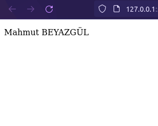
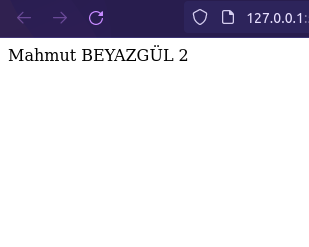
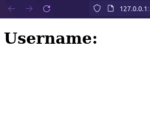
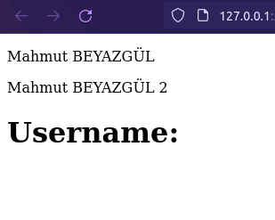

# DOM (Document Object Model)

## Table of Content

- [What is the DOM?]()
- [What is the HTML DOM?]()
- [HTML DOM Document]()
  - [Finding HTML Elements]()
  - [Changing HTML Elements]()
  - [Adding and Deleting Elements]()
  - [Adding Events Handlers]()
  - [Finding HTML Objects]()
  - []()
- []()

## What is the DOM?

The DOM is a W3C (World Wide Web Consortium) standard. The DOM defines a standard for accessing documents.

"The W3C Document Object Model (DOM) is a platform and language-neutral interface that allows programs and scripts to dynamically access and update the content, structure, and style of a document."

The W3C DOM standard is separated into 3 different parts.

- Core DOM - standard model for all document types
- XML DOM - standard model for XML documents
- HTML DOM - standard model for HTML documents

## What is the HTML DOM?

The HTML DOM is a standard object model and programming interface for HTML. It defines:

- The HTML elements as objects
- The properties of all HTML elements
- The methods to access all HTML elements
- The events for all HTML elements

The HTML DOM is a standard for how to get, change, add, or delete HTML elements.

## HTML DOM Document

The HTML DOM document object is the owner of all other objects in your web page. The document object represents your web page. If you want to access any element in an HTML page, you always start with accessing the document object.

Below are some examples of how you can use the document object to access and manipulate HTML.

### 1. Finding HTML Elements

|                   Methods                   |         Descriptions          |
| :-----------------------------------------: | :---------------------------: |
|      document.getElementById(_**id**_)      | Find an element by element id |
|  document.getElementsByTagName(_**name**_)  |   Find elements by tag name   |
| document.getElementsByClassName(_**name**_) |  Find elements by class name  |

### 2. Changing HTML Elements

|               Property               |                 Descriptions                  |
| :----------------------------------: | :-------------------------------------------: |
| element.innerHTML = new html content |      Change the inner HTML of an element      |
|    element.attribute = new value     | Change the attribute value of an HTML element |
|  element.style.property = new style  |      Change the style of an HTML element      |

|                       Method                       |                  Description                  |
| :------------------------------------------------: | :-------------------------------------------: |
| element.setAttribute(_**attribute**_, _**value**_) | Change the attribute value of an HTML element |

### 3. Adding and Deleting Elements

|                   Methods                   |           Descriptions            |
| :-----------------------------------------: | :-------------------------------: |
|    document.createElement(_**element**_)    |      Create an HTML element       |
|     document.removeChild(_**element**_)     |      Remove an HTML element       |
|     document.appendChild(_**element**_)     |        Add an HTML element        |
| document.replaceChild(_**new**_, _**old**_) |      Replace an HTML element      |
|         document.write(_**text**_)          | Write into the HTML output stream |

### 4. Adding Events Handlers

|                               Method                               |                  Description                  |
| :----------------------------------------------------------------: | :-------------------------------------------: |
| document.getElementById(_**id**_).onclick = function(){_**code**_} | Adding event handler code to an onclick event |

### 5. Finding HTML Objects

|           Property           |                           Description                            | DOM Level |
| :--------------------------: | :--------------------------------------------------------------: | :-------: |
|       document.anchors       |       Returns all \<a> elements that have a name attribute       |     1     |
|       document.applets       |                            Deprecated                            |     1     |
|       document.baseURI       |          Returns the absolute base URI of the document           |     3     |
|        document.body         |                   Returns the \<body> element                    |     1     |
|       document.cookie        |                  Returns the document's cookie                   |     1     |
|       document.doctype       |                  Returns the document's doctype                  |     3     |
|   document.documentElement   |                   Returns the \<html> element                    |     3     |
|    document.documentMode     |               Returns the mode used by the browser               |     3     |
|     document.documentURI     |                 Returns the URI of the document                  |     3     |
|       document.domain        |          Returns the domain name of the document server          |     1     |
|      document.domConfig      |                            Obsolete.                             |     3     |
|       document.embeds        |                  Returns all \<embed> elements                   |     3     |
|        document.forms        |                   Returns all \<form> elements                   |     1     |
|        document.head         |                   Returns the \<head> element                    |     3     |
|       document.images        |                   Returns all \ elements                    |     1     |
|   document.implementation    |                  Returns the DOM implementation                  |     3     |
|    document.inputEncoding    |         Returns the document's encoding (character set)          |     3     |
|    document.lastModified     |        Returns the date and time the document was updated        |     3     |
|        document.links        | Returns all \<area> and \<a> elements that have a href attribute |     1     |
|     document.readyState      |           Returns the (loading) status of the document           |     3     |
|      document.referrer       |      Returns the URI of the referrer (the linking document)      |     1     |
|       document.scripts       |                  Returns all \<script> elements                  |     3     |
| document.strictErrorChecking |              Returns if error checking is enforced               |     3     |
|        document.title        |                   Returns the \<title> element                   |     1     |
|         document.URL         |             Returns the complete URL of the document             |     1     |

**Examples:**

Assume we have the following HTML document.

```html
<!DOCTYPE html>
<html lang="en">
  <head>
    <meta charset="UTF-8" />
    <meta name="viewport" content="width=device-width, initial-scale=1.0" />
    <title>HTML_DOM</title>
  </head>

  <body>
    <script>
      // We will write here.
    </script>
  </body>
</html>
```

**Example 1:**

```js
let div = document.createElement("div"); // Create a new <div> element
div.id = "userNameId"; // Adding an id to the div
div.className = "userNameClass"; // Adding a class to the div.
div.innerHTML = "<p>Mahmut BEYAZGÜL</p>"; // Add an HTML snippet to the div
document.body.appendChild(div); // Insert div into the document
```



**Example 2:**

```js
let div = document.createElement("div");
document.body.appendChild(div);

let text = document.createTextNode("Mahmut BEYAZGÜL 2"); // Create a new text node
div.appendChild(text); // Insert text into the div
document.body.appendChild(div);
```



**Example 3:**

```js
let div = document.createElement("div");
document.body.appendChild(div);

let h1 = document.createElement("h1"); // Create a new heading
h1.textContent = "Username:"; // Determine the content of element h1
div.appendChild(h1); // Insert h1 into the div
document.body.appendChild(div);
```



**Example 4:**

If we write all the cods at the same time.

```js
let div = document.createElement("div");
div.id = "userNameId";
div.className = "userNameClass";
div.innerHTML = "<p>Mahmut BEYAZGÜL</p>";
document.body.appendChild(div);

let text = document.createTextNode("Mahmut BEYAZGÜL 2");
div.appendChild(text);

let h1 = document.createElement("h1");
h1.textContent = "Username:";
div.appendChild(h1);
```


